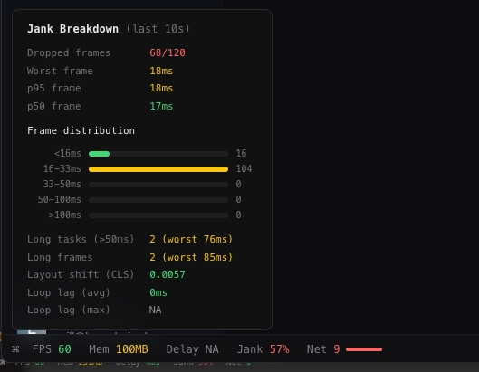

# Jenk Meter

Linear-style developer performance toolbar for any web app. Chrome/Arc extension that overlays live metrics at the bottom of every page.



## Metrics

| Metric | What it measures |
|--------|-----------------|
| **FPS** | Frames per second (from `requestAnimationFrame` deltas) |
| **Mem** | JS heap usage (Chrome-only) |
| **Delay** | Event-loop lag — how long the main thread is blocked |
| **Jank** | % of frames that missed the 16.67ms budget |
| **Net** | In-flight `fetch` and `XMLHttpRequest` count |

Click **Jank** for a detailed breakdown: long tasks, layout shifts, frame histogram, and more.

## Install

1. Clone the repo:
   ```
   git clone https://github.com/hinthornw/jenk-meter.git
   ```
2. Open your browser's extension page:
   - **Chrome**: navigate to `chrome://extensions`
   - **Arc**: navigate to `arc://extensions`
   - **Brave**: navigate to `brave://extensions`
   - **Edge**: navigate to `edge://extensions`
3. Enable **Developer mode**
   - **Chrome / Brave / Edge**: toggle in the top-right corner
   - **Arc**: toggle at the top of the extensions page
4. Click **Load unpacked** and select the `jenk-meter` folder
5. Navigate to any page and refresh — the toolbar appears at the bottom

## Controls

- Click **Jank** to open/close the breakdown tooltip
- **↓** — Collapse the toolbar to just the controls
- **—** — Hide the toolbar (refresh the page to bring it back)

## In-app usage (without extension)

If you want to embed it directly in your app instead:

```ts
import { JankMeter } from "./src/jank-meter";

const jm = new JankMeter({ enabled: true });
jm.start();

// Optional: clean up
jm.stop();
```

## License

MIT
